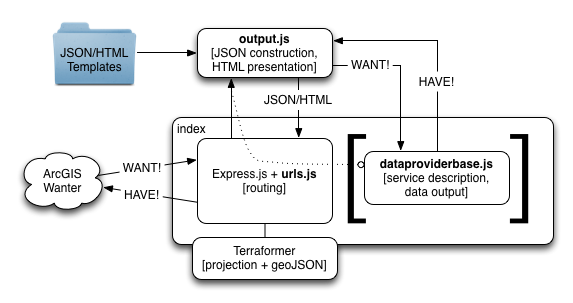

node-geoservices-adaptor
========================

This is a [node.js](http://nodejs.org) implementation of part of the [ArcGIS REST API](http://resources.arcgis.com/en/help/arcgis-rest-api/).

Enough of the API is implemented to allow simple read-only access by ArcGIS tools, apps, and APIs, including [ArcGIS Runtime SDKs](https://developers.arcgis.com/en/documentation/) (iOS, Android, Mac OS X, Windows Phone, etc.), [ArcGIS API for JavaScript](https://developers.arcgis.com/en/javascript/), [esri-leaflet](http://esri.github.io/esri-leaflet/), [ArcGIS Desktop](http://www.esri.com/software/arcgis/arcgis-for-desktop) etc.

View live at http://geonode.geeknixta.com

##Introduction
The application handles mapping ArcGIS Server-style FeatureService REST requests to 1 or more "data providers", and the presentation of "data provider" output back to the caller in appropriate ArcGIS JSON Output format.

Each data provider interprets the mapped requests to declare feature services and layers, and to return query results.

The application will do as much work as possible to correctly generate outgoing JSON, but each adaptor has access to the generated JSON to modify it as appropriate.

This prototype application has two sample data providers:

* CityBikes: Provide data from http://api.citybik.es.
* GeoHub: Provide data from geoJSON files stored in GitHub Repositories and Gists.

You can similarly create your own data providers:

1. Build your own subclass of `dataproviderbase.DataProviderBase` (see [citybike.js](https://github.com/ArcGIS/node-geoservices-adaptor/blob/master/dataProviders/citybikes.js) for a sample). Override only what you need to.
2. Add instances of your subclass to the `dataProviders` array in `index.js`

The application handles generating appropriate HTML for each endpoint to help explore the services and reach a FeatureLayer endpoint for consumption by the ArcGIS tools and APIs.

At a glance, this is how it works:

* **urls**: Construct Adaptor and Template REST Endpoints.
* **output**: Construct JSON output. Format HTML output for JSON.
* **dataproviderbase**: Describe the service (fields, idField, nameField, etc.) and return features when requested. Inherit from this and selectively override to add a provider.

Making use of the [Terraformer](https://github.com/esri/terraformer) library, the application is able to support outputting in [geoJSON](http://www.geojson.org/geojson-spec.html) by specifying `f=geojson`.

## Requirements
* [node.js](http://nodejs.org)

##Installation
1. Clone the repo and run `npm update` in the repo folder
2. Run the node server with `node index`
3. Browse to [http://localhost:1337](http://localhost:1337)

##Sample Data Providers
###Citybikes
The Citybikes sample data provider makes use of the [awesome API](http://api.citybik.es) at [CityBik.es](http://citybik.es) providing bike share data (almost) globally. This sample Data Provider adapts the data into Geoservices format output. The root REST endpoint 
for the CityBikes data provider can be found live here (this is where you might point ArcCatalog): http://node-geoservices-adaptor.aws.af.cm/citybikes/rest/services
###GeoHub
Making use of the [GeoHub repo](https://github.com/chelm/geohub), this sample provider allows a client to request geoJSON files from either a GitHub repository ([example](https://github.com/chelm/grunt-geo/blob/master/forks.geojson)) or from a GitHub gist ([example](https://gist.github.com/chelm/6178185)). The following additional query parameters are implemented:

* repo
	* **githubUser**: The repo owner's username.
	* **repoName**: The name of the repo containing the GeoJSON file.
	* **filePath**: The path to the GeoJSON file within the repo. Note, you should not include the ".geojson" file extension.
	* **geoJSONType** (optional): The geoJSON Geometry Type to extract (since an ArcGIS FeatureLayer may only emit a featureset with a single geometry type). If this is omitted, the first geoJSON Geometry will define the type used to filter on.
	* **f** (optional): Setting this to `geojson` returns the contents of the geoJSON file unprocessed.
* gist
	* **gistId**: The unique ID of the Gist
	* **gistFileIndex** (optional): If the gist has multiple .geojson files, specify which one should be returned (zero-based index, default value 0).
	* **geoJSONType** (optional): The geoJSON Geometry Type to extract (since an ArcGIS FeatureLayer may only emit a featureset with a single geometry type). If this is omitted, the first geoJSON Geometry will define the type used to filter on.
	* **f** (optional): Setting this to `geojson` returns the contents of the geoJSON file unprocessed.

##Known Limitations
* Only a limited subset of the [Geoservices REST Specification](http://resources.arcgis.com/en/help/arcgis-rest-api/) is implemented.
	* [`Server Info`](http://resources.arcgis.com/en/help/arcgis-rest-api/#/Server_Info/02r300000116000000/)
	* [`Catalog`](http://resources.arcgis.com/en/help/arcgis-rest-api/#/Catalog/02r3000000tn000000/)
	* [`Feature Service`](http://resources.arcgis.com/en/help/arcgis-rest-api/#/Feature_Service/02r3000000z2000000/)
	* `Layers (Feature Service)`
	* [`Layer (Feature Service)`](http://resources.arcgis.com/en/help/arcgis-rest-api/#/Layer/02r3000000w6000000/)
	* [`Query (Feature Service\Layer)`](http://resources.arcgis.com/en/help/arcgis-rest-api/#/Query_Feature_Service_Layer/02r3000000r1000000/)
* Only spatial references 4326 and 102100 are supported.
* The application will convert from 4326 to 102100 only.
* Queries only work against the layer end point. `Query (Feature Service)` is declared as a capability but not yet implemented.
* HTML Browsing is not available for Query endpoints. All queries return JSON.
* Only a subset of [`Query (Feature Service\Layer)`](http://resources.arcgis.com/en/help/arcgis-rest-api/#/Query_Feature_Service_Layer/02r3000000r1000000/) is implemented:
	* `objectIds`
	* `outSR` (4326 and 102100 only)
	* `returnIdsOnly`
	* `returnCountOnly`
* Authentication and tokenization is not implemented. All services are considered public.

## Resources

* [ArcGIS REST Specification](http://resources.arcgis.com/en/help/arcgis-rest-api/)
* [Terraformer](https://github.com/esri/terraformer) by [Esri](http://esri.github.io)
* [node.js documentation](http://nodejs.org/api/)
* [express.js documentation](http://expressjs.com/api.html)
* [CityBikes API](http://api.citybik.es)
* [GeoHub](https://github.com/chelm/geohub)
* [geoJSON Specification](http://www.geojson.org/geojson-spec.html)

## Issues

Find a bug or want to request a new feature?  Please let us know by submitting an Issue.

## Contributing

Anyone and everyone is welcome to contribute. 

## Licensing
Copyright 2013 Esri

Licensed under the Apache License, Version 2.0 (the "License");
you may not use this file except in compliance with the License.
You may obtain a copy of the License at

   http://www.apache.org/licenses/LICENSE-2.0

Unless required by applicable law or agreed to in writing, software
distributed under the License is distributed on an "AS IS" BASIS,
WITHOUT WARRANTIES OR CONDITIONS OF ANY KIND, either express or implied.
See the License for the specific language governing permissions and
limitations under the License.

A copy of the license is available in the repository's [license.txt](https://github.com/ArcGIS/node-geoservices-adaptor/blob/master/license.txt) file.

